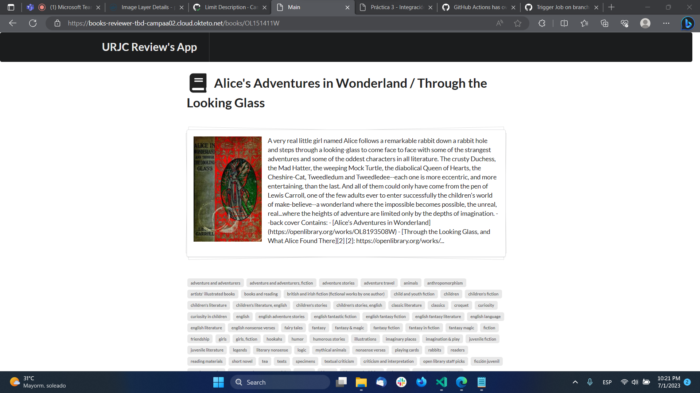

# AIS-Practica-3-2023-TBD

Autor(es): Daniel Andrés Barbera Dimoftache, Pablo Campanero Arévalo

[Repositorio](https://github.com/Campaa02/ais-da.barbera.2020-p.campanero.2020-2023-tbd/)

[Aplicación Okteto](https://books-reviewer-tbd-campaa02.cloud.okteto.net/)



[Última imagen de Docker desplegada con el workflow nocturno](https://hub.docker.com/layers/pca06/books-reviewer/0802e390fc9d35cd3717ab330f4b0205b8e2e524/images/sha256-540edb20e80e61b48f4cc5c78ca26f1faf5409a5351d4e0e4c1ceba2e0c6719c?context%253Dexplore)

[Último workflow nocturno ejecutado durante la realización de esta memoria](https://github.com/Campaa02/ais-da.barbera.2020-p.campanero.2020-2023-tbd/actions/runs/5432802390) (ejecutado manualmente, se espera que durante la revisión de la memoria haya varios)

[Última imagen de Docker del despliegue a Okteto](https://hub.docker.com/layers/pca06/books-reviewer/aa63182684f6bbb7b654e79a66d2b32c2cdac37d/images/sha256-540edb20e80e61b48f4cc5c78ca26f1faf5409a5351d4e0e4c1ceba2e0c6719c?context%253Dexplore)

## Notas de los autores

En todos los workflows, se ha habilitado el evento `workflow_dispatch` para la ejecución de workflows de forma manual, para que el corrector pueda ejecutarlos sin necesidad de hacer cambios en el repositorio.

Para desarrollar mediante TBD, es necesario emplear _feature flags_ a la hora de realizar los cambios, para que estos no afecten al funcionamiento de la aplicación. No se ha hecho ya que la práctica no propone el uso de las mismas o de un posible caso de _roll-forward_, y por tanto, no se ha considerado necesario. No obstante, si hubiere necesidad de hacerlo, sería cuestión de emplear [la API de perfiles de Spring](https://www.baeldung.com/spring-feature-flags) o variables de entorno pasadas a través de los workflows, o quizás incluso algo tan simple como un `if (true/false) { feature } else { feature antigua }`, dependiendo de las exigencias.

El corrector de la práctica podrá observar que existe multitud de ramas, pull requests y ejecuciones de workflows, de las que no se hace mención. Inicialmente, empleamos el repositorio para hacer pruebas, y una vez conseguimos resultados satisfactorios, reescribimos el historial de Git con los comandos:

```sh
$ git rebase --interactive --autosquash @~<n> # Reescribir los últimos n commits
# ... squash de los últimos n commits ...
$ git push --force-with-lease # Forzar la subida de los cambios al repositorio remoto, mientras no haya cambios en la rama remota
```

## Desarrollo con Trunk Based Development

Creamos un repositorio privado utilizando [la plantilla para la práctica](https://github.com/URJC-AIS/AIS-Practica-3-2023-template) mediante la interfaz web de GitHub. Una vez creado, clonamos el repositorio en nuestro dispositivo ejecutando el siguiente comando:

```sh
$ git clone https://github.com/Campaa02/ais-da.barbera.2020-p.campanero.2020-2023-tbd/
```

Después, procedemos a crear los workflows 1-4, realizando commits sobre la rama `trunk`. Para ello, hizo falta ejecutar los siguientes comandos:

```sh
# Cambiamos el nombre de la rama master a trunk
$ git branch -m master trunk # La flag -m indica que se va a cambiar el nombre de la primera rama a la segunda
$ git fetch origin # Actualizar la información de las ramas remotas
$ git branch -u origin/trunk trunk # Establecer la rama trunk como upstream de la rama local trunk
$ git remote set-head origin -a # Establecer la rama trunk como HEAD de la rama remota

$ git pull # Actualizar la rama local con los cambios de la remota, si los hubiera
# ... Realizar cambios ...
$ git add . # Añadir los cambios en el directorio actual al stage
$ git commit -m "Mensaje del commit" # Fijar los cambios de forma definitiva en la rama
$ git push # Subir los cambios al repositorio remoto
```

Una vez creados los workflows y funcionando estos, pasamos a crear la nueva funcionalidad utilizando TBD:

## Rama de feature
```sh
$ git checkout -b feature/limit-description-limit # Crear una nueva rama a partir de trunk y cambiar a ella
# ... Realizar cambios, git add, git commit ...
git push --set-upstream origin feature/limit-description-limit # Subir la rama al repositorio remoto
```

Generamos una [Pull Request](https://github.com/Campaa02/ais-da.barbera.2020-p.campanero.2020-2023-tbd/pull/4), siguiendo el estilo TBD, y la revisamos. Una vez revisada, la mergeamos con trunk.

### Workflows ejecutados
- 1: [Workflow](https://github.com/Campaa02/ais-da.barbera.2020-p.campanero.2020-2023-tbd/actions/runs/5432775728) de tests unitarios y de integración, al crear el commit sobre la rama feature, ya que en TBD se crea un commit por cada funcionalidad.
- 2: [El mismo workflow](https://github.com/Campaa02/ais-da.barbera.2020-p.campanero.2020-2023-tbd/actions/runs/5432776768), al abrir la pull request, ya que este es el momento previo a la integración con la rama `trunk`.
- 3: [Workflow](https://github.com/Campaa02/ais-da.barbera.2020-p.campanero.2020-2023-tbd/actions/runs/5432779662/jobs/9880044814) con todos los tests, al integrarse la rama `feature/limit-description-limit` con `trunk`.

## Rama de release
```sh
$ git log --oneline # Obtener el hash del commit a través del resumen del log
$ git checkout -b release-<hash> # Crear una nueva rama a partir de trunk y cambiar a ella
$ git push --set-upstream origin release-<hash> # Subir la rama al repositorio remoto
```

### Workflows ejecutados
- 1: [Workflow de despliegue a Okteto](https://github.com/Campaa02/ais-da.barbera.2020-p.campanero.2020-2023-tbd/actions/runs/5432888637), ejecutado tras crear la rama de release, ya que es el momento en el que se va a desplegar la aplicación en Okteto.

Durante la realización de la práctica hubo problemas con este workflow, al no entender que el evento `push` de GitHub se emite tambíen cuando se crea una rama. Inicialmente, se había configurado el workflow para que se ejecutara al crearse una rama con el evento `create` y una regla condicional sobre el nombre de la rama:

```yaml
on:
  push:
    branches:
      - release-*
  create:

jobs:
    deploy:
        if: startsWith(github.ref, 'refs/heads/release-')
        ...
```

Esto provocaba que se ejecutara dos veces, una al crearse la rama y otra al hacer el push de la rama al repositorio remoto. Para solucionar esto, se cambió el evento que activa el workflow a `workflow_dispatch`, que permite ejecutar el workflow manualmente.